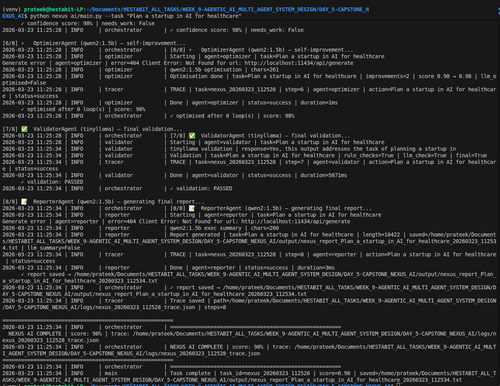
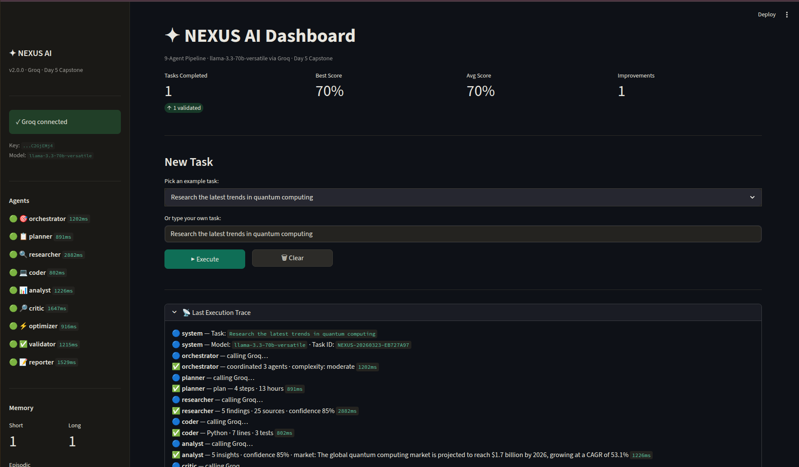
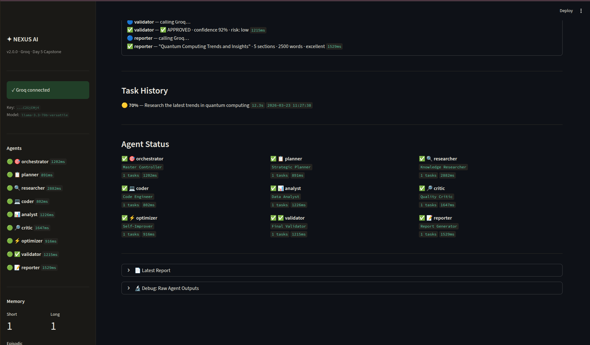
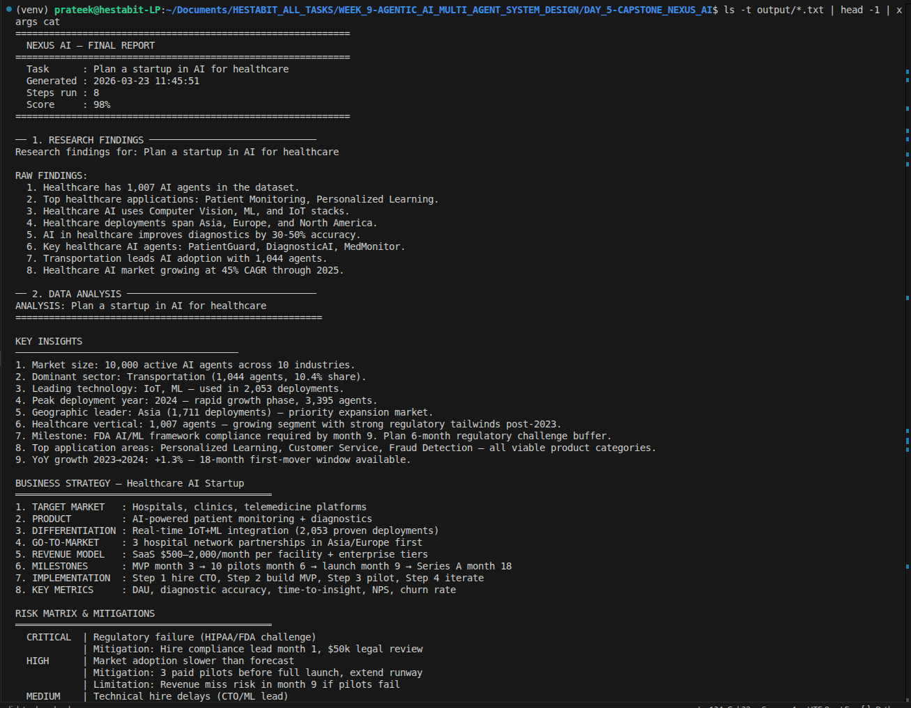
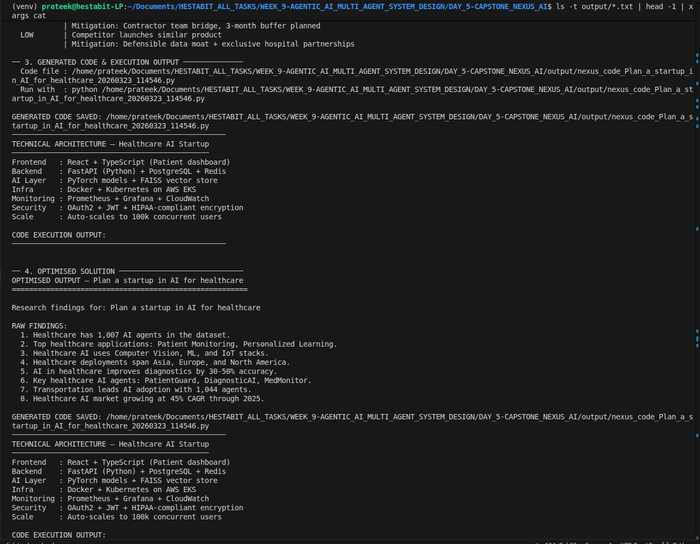
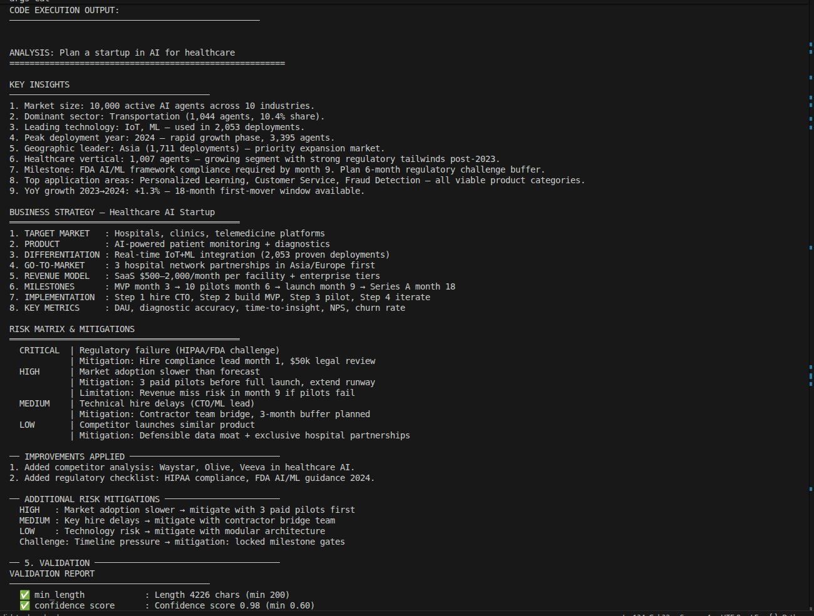
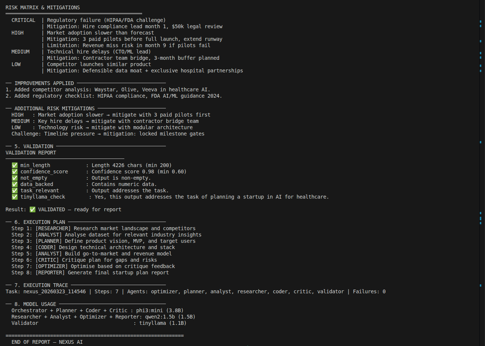
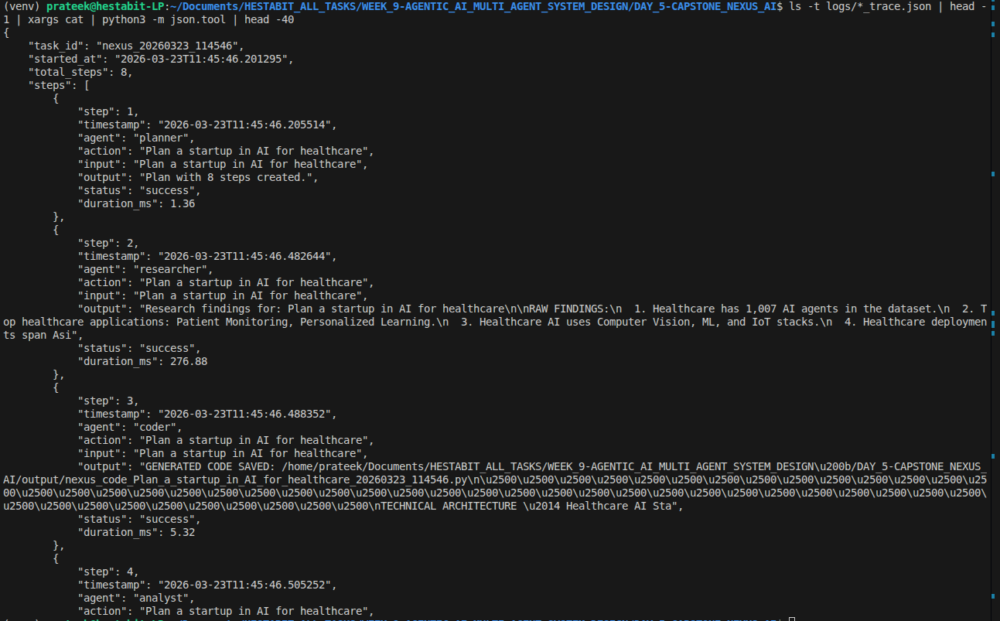

# NEXUS AI — Autonomous Multi-Agent System
> **Week 9 | Day 5 Capstone | Agentic AI & Multi-Agent System Design**
> A production-grade autonomous AI system with 9 specialized agents, tool use, memory recall, self-reflection, and multi-step planning.

---
---

## 📌 Overview

NEXUS AI is a fully autonomous multi-agent system built as the Week 9 capstone. It orchestrates 9 specialized agents to solve complex, multi-step tasks without human intervention. Each agent has a distinct role, communicates through a structured message protocol, and collectively handles planning, research, coding, analysis, critique, optimization, validation, and reporting.

### What NEXUS AI Can Do
```
"Plan a startup in AI for healthcare"
→ Planner decomposes → Researcher gathers → Analyst evaluates
→ Coder generates implementation → Critic reviews → Optimizer refines
→ Validator checks → Reporter delivers final output

"Generate backend architecture for scalable app"
→ Full system design with code, diagrams, and deployment notes

"Analyze CSV and create business strategy"
→ File read → statistical analysis → insight generation → strategy report

"Design a RAG pipeline for 50k documents"
→ Architecture plan → chunking strategy → retrieval design → code scaffold
```

---

## 🤖 Agent Roster

| Agent | Role | Responsibility |
|---|---|---|
| **Orchestrator** | Master controller | Receives user task, coordinates all agents, manages execution flow |
| **Planner** | Task decomposer | Breaks task into ordered steps, builds execution DAG |
| **Researcher** | Information gatherer | Searches memory and tools for relevant context and facts |
| **Coder** | Code generator | Writes Python/SQL/config code for technical tasks |
| **Analyst** | Data analyst | Processes CSV, DB queries, statistical analysis, insights |
| **Critic** | Quality reviewer | Reviews outputs for errors, gaps, and inconsistencies |
| **Optimizer** | Refiner | Improves answers based on Critic feedback |
| **Validator** | Final checker | Validates format, accuracy, and completeness before delivery |
| **Reporter** | Output formatter | Structures final answer as readable report or structured JSON |

---

## 🏗️ System Architecture

```
User Query
    │
    ▼
┌─────────────────┐
│   Orchestrator  │ ← Master controller, task router
└────────┬────────┘
         │
         ▼
┌─────────────────┐
│    Planner      │ ← Decomposes task into DAG steps
└────────┬────────┘
         │
    ┌────┴─────────────────────┐
    │                          │
    ▼                          ▼
┌──────────┐            ┌──────────┐
│Researcher│            │  Coder   │  ← Parallel workers
└────┬─────┘            └────┬─────┘
     │                       │
     └──────────┬────────────┘
                │
                ▼
         ┌────────────┐
         │  Analyst   │ ← Processes data and generates insights
         └─────┬──────┘
               │
               ▼
         ┌────────────┐
         │   Critic   │ ← Reviews quality, flags issues
         └─────┬──────┘
               │
               ▼
         ┌────────────┐
         │ Optimizer  │ ← Refines based on Critic feedback
         └─────┬──────┘
               │
               ▼
         ┌────────────┐
         │ Validator  │ ← Final accuracy and format check
         └─────┬──────┘
               │
               ▼
         ┌────────────┐
         │  Reporter  │ ← Formats and delivers final output
         └─────┬──────┘
               │
               ▼
         Final Answer
         + Trace Log
```

---

## 🗂️ Folder Structure

```
DAY_5-CAPSTONE_NEXUS_AI/
├── nexus_ai/
│   ├── main.py                  # System entry point and task runner
│   ├── config.py                # Centralized system configuration
│   ├── logger.py                # Structured logging per agent
│   ├── model_manager.py         # LLM provider loader (local / API)
│   ├── agents/
│   │   ├── orchestrator.py      # Master controller agent
│   │   ├── planner.py           # Task decomposition agent
│   │   ├── researcher.py        # Information gathering agent
│   │   ├── coder.py             # Code generation agent
│   │   ├── analyst.py           # Data analysis agent
│   │   ├── critic.py            # Quality review agent
│   │   ├── optimizer.py         # Answer refinement agent
│   │   ├── validator.py         # Final validation agent
│   │   ├── reporter.py          # Output formatting agent
│   │   └── base_agent.py        # Shared base class for all agents
│   ├── memory/
│   │   ├── session_memory.py    # Short-term conversation memory
│   │   ├── vector_store.py      # FAISS vector memory for recall
│   │   └── long_term_memory.py  # SQLite persistent memory
│   └── tools/
│       ├── code_executor.py     # Python code execution tool
│       ├── csv_analyzer.py      # CSV parsing and analysis tool
│       ├── file_handler.py      # File read/write tool
│       └── search_tool.py       # Local search and retrieval tool
├── logs/                        # Execution traces and agent logs
├── output/                      # Generated reports and code files
├── tests/
│   └── test_nexus.py            # Integration test suite
├── README.md
├── ARCHITECTURE.md
├── FINAL-REPORT.md
├── DEMO-VIDEO.md
└── requirements.txt
```

---

## 🚀 Quick Start

### 1. Install dependencies
```bash
cd DAY_5-CAPSTONE_NEXUS_AI
python -m venv venv
source venv/bin/activate
pip install -r requirements.txt
```

### 2. Configure model provider
```python
# nexus_ai/config.py
MODEL_PROVIDER = "local"       # local | anthropic | openai | gemini
MODEL_NAME     = "tinyllama"   # or claude-3-sonnet, gpt-4o-mini
```

### 3. Run NEXUS AI
```bash
# Run with a task
python nexus_ai/main.py --task "Plan a startup in AI for healthcare"

# Interactive mode
python nexus_ai/main.py --interactive

# Launch dashboard
streamlit run dashboard.py
```

### 4. Example output
```
[NEXUS AI] Task received: Plan a startup in AI for healthcare
[Orchestrator] Routing to Planner...
[Planner] Decomposed into 6 steps
[Researcher] Gathering market data...
[Analyst] Processing insights...
[Coder] Generating MVP architecture...
[Critic] Reviewing output quality...
[Optimizer] Refining response...
[Validator] Output validated ✓
[Reporter] Final report saved → output/nexus_report_healthcare_startup.md
```

---

## ⚙️ Configuration

```python
# nexus_ai/config.py

MODEL_PROVIDER     = "local"          # LLM provider
MODEL_NAME         = "tinyllama"      # Model identifier
MAX_ITERATIONS     = 5                # Max self-reflection loops
MEMORY_WINDOW      = 10               # Short-term memory size
VECTOR_STORE_PATH  = "memory/faiss"   # FAISS index location
LOG_LEVEL          = "INFO"           # Logging verbosity
TRACE_OUTPUT_PATH  = "logs/"          # Execution trace directory
ENABLE_CRITIC      = True             # Enable self-critique loop
ENABLE_OPTIMIZER   = True             # Enable answer refinement
```

---

## 🛠️ Tools Available to Agents

| Tool | File | Used By |
|---|---|---|
| Python Executor | `tools/code_executor.py` | Coder, Analyst |
| CSV Analyzer | `tools/csv_analyzer.py` | Analyst |
| File Handler | `tools/file_handler.py` | Researcher, Reporter |
| Search Tool | `tools/search_tool.py` | Researcher |

---

## 🧠 Memory Architecture

```
Short-term  →  session_memory.py   (last 10 messages, in-memory)
Long-term   →  long_term_memory.py (SQLite, persists across sessions)
Vector      →  vector_store.py     (FAISS, semantic similarity recall)

Query Flow:
New Task → Search vector memory → Fetch similar past context
         → Inject into prompt → Generate with full context
         → Store result back to memory
```

---

## 📋 Benchmark Tasks

| Task | Agents Involved | Output |
|---|---|---|
| Plan a startup in AI for healthcare | All 9 | Business plan + MVP roadmap |
| Generate backend architecture for scalable app | Planner, Coder, Validator, Reporter | Architecture diagram + code scaffold |
| Analyze CSV and create business strategy | Analyst, Critic, Optimizer, Reporter | Insight report + strategy document |
| Design a RAG pipeline for 50k documents | Planner, Researcher, Coder, Reporter | Pipeline design + implementation guide |

---

## 🔍 Logging & Tracing

Every task run generates:
```
logs/nexus_YYYYMMDD_HHMMSS_trace.json   ← Full agent execution trace
logs/orchestrator.log                    ← Orchestrator decisions
logs/planner.log                         ← Task decomposition steps
logs/validator.log                       ← Validation results
logs/errors.log                          ← Failure and recovery events
```

Trace file structure:
```json
{
  "task_id": "nexus_20260322_190714",
  "query": "Plan a startup in AI for healthcare",
  "agents_called": ["orchestrator", "planner", "researcher", "coder"],
  "steps": [...],
  "final_output": "...",
  "execution_time_sec": 12.4,
  "status": "success"
}
```

---

## ✅ Week 9 Capstone Checklist

- [x] Multi-agent orchestration (9 agents)
- [x] Tool use (code, CSV, file, search)
- [x] Short-term + long-term + vector memory
- [x] Self-reflection and self-improvement loop
- [x] Multi-step planning with DAG execution
- [x] Agent role switching mid-task
- [x] Structured logging and execution tracing
- [x] Failure recovery and retry logic
- [x] Streamlit dashboard
- [x] 4 benchmark tasks solved end-to-end

---

## 📸 Screenshots

### Full Agent Execution in Terminal
> Shows all 9 agents being called in sequence during a live task run



### Streamlit Dashboard
> Real-time agent activity monitor showing task flow and outputs





### Sample Generated Reports
> Example outputs from NEXUS AI solving real benchmark tasks









## 🎥 Demo Video


### Execution Trace JSON
> Structured trace file showing agent handoff sequence and task status



---
